# Gesture Handling

This document details how user gestures are handled to manage cell and row selection in the grid.

---

## Gesture-Specific Logic

### OnTapUp

This is the most complex gesture, as it handles multiple selection modes (normal, single-tap, and modifier-key-based).

Click to see the flowchart

For better diagram quality, see [onTapUp_flow.svg](./onTapUp_flow.svg)

### OnLongPressStart

- This gesture sets `currentCell` as the anchor point for the selection.
- And also set `isSelecting` to true.

Click to see the flowchart

### OnLongPressMoveUpdate

While selecting, this gesture updates the selection range as the user drags their pointer. It calculates the new selection position based on the drag offset and updates the selected cells or rows accordingly. It also handles auto-scrolling when the drag reaches the edge of the grid.

For better diagram quality, see [onLongPressMoveUpdate-horizontal.svg](./onLongPressMoveUpdate-horizontal.svg)

### OnLongPressEnd

- Finalize the selection state. 
- Stop any active auto-scrolling.
- Update the current cell.

#### Flow diagram

### OnDoubleTap

A double tap can either toggle selection in popup mode or enter edit mode, depending on the grid's configuration.

#### Flow diagram

Or click to view 

For better quality, see [onDoubleTap_flow.svg](./onDoubleTap_flow.svg)

### OnSecondaryTap

A secondary tap (right-click) is primarily used to open context menus, but it also affects selection. In single-tap selection mode:
- it updates the selection
- enter edit mode.

#### Flow diagram

For better quality, see [onSecondaryTap_flow.svg](./onSecondaryTap_flow.svg)

