# Gesture Handling

This document details how user gestures are handled to manage cell and row selection in the grid.

---

## OnTapUp

View details

For better diagram quality, see [onTapUp.svg](./onTapUp_flow.svg)

### Main Flow
1. **Initial Check**: Determines if this is the first tap to focus the grid
2. **Selection Mode Check**: Checks if a selection interaction is in progress (Shift or Ctrl/Cmd key pressed)
3. **Selection Handling**: handle selection based on previous condition.

### Selection Handling

#### Shift Key Handling (Range Selection)
1. Sets the current selecting position
2. If there's no current cell position, it sets one.
3. Proceeds based on selection mode:
   - **Cell Mode**: Selects all cells in the range
   - **Row Mode**: Selects all rows in the range
4. Notifies about the selection change

#### Ctrl/Cmd Key Handling (Multi-Selection)

1. Based on selection mode (cell or row):

#### For Cell Selection:
   - Determines if the tapped cell is the current cell and if it was already selected.
   - If there's a current cell but no selected cells, it adds the current cell to the selection.
   - Toggles the selection state of the tapped cell.
   - If the cell was selected but is now unselected and it was the current cell, it clears the current cell.

#### For Row Selection:
   - If no rows are selected and the current row is different from the tapped row, it selects the current row.
   - Toggles the selection state of the tapped row.

2. Finally, it updates the current selection position, sets the current cell position, and triggers the onSelected handler.

### Normal Tap Handling
1. Checks if the tapped cell is already the current cell
   - **Yes**: Enters edit mode
   - **No**: Sets the tapped cell as current
2. If not in popup mode, notifies about the selection change

## OnLongPressStart

- This gesture sets `currentCell` as the anchor point for the selection.
- And also set `isSelecting` to true.

Click to see the flowchart

### OnLongPressMoveUpdate

While selecting, this gesture updates the selection range as the user drags their pointer. It calculates the new selection position based on the drag offset and updates the selected cells or rows accordingly. It also handles auto-scrolling when the drag reaches the edge of the grid.

For better diagram quality, see [onLongPressMoveUpdate-horizontal.svg](./onLongPressMoveUpdate-horizontal.svg)

### OnLongPressEnd

- Finalize the selection state. 
- Stop any active auto-scrolling.
- Update the current cell.

#### Flow diagram

### OnDoubleTap

A double tap can either toggle selection in popup mode or enter edit mode, depending on the grid's configuration.

#### Flow diagram

Or click to view 

For better quality, see [onDoubleTap_flow.svg](./onDoubleTap_flow.svg)

### OnSecondaryTap

