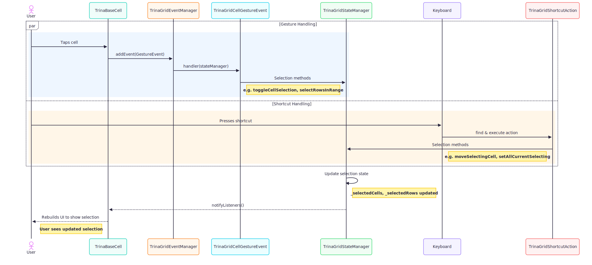

# Selection Feature: Developer Guide

## 1. Introduction

This document provides a developer-oriented overview of the cell and row selection feature in TrinaGrid. It covers the high-level architecture, the core components involved, and how they interact to provide a flexible selection mechanism.

## 2. High-Level Architecture

The selection feature is built on a reactive state management pattern. User interactions in the UI trigger events that are processed by a central state manager. The state manager updates the selection state, and the UI widgets listen to these state changes to rebuild themselves accordingly.

This decoupled architecture separates the selection logic (state management) from the UI representation, making the system easier to maintain and extend.

### Architectural Diagram

The following sequence diagram illustrates the handling of user gestures and keyboard input which enables cell and row selection in the grid.

### Core Components

#### - UI Layer (TrinaBaseCell, TrinaBaseRow)

- These widgets are responsible for rendering cells and rows and capturing raw user input (taps, drags).
- They don't contain any selection logic themselves but instead dispatch events to the state manager.
- For more details, see the [UI Components documentation](./ui_components.md).

#### - TrinaGridStateManager

- Receives events from the UI and holds the single source of truth for the grid's state. For selection, it uses the `SelectingState` mixin to handle the logic.
- It provides the public API that UI widgets and external code use to interact with the grid's selection state.

#### - TrinaGridCellGestureEvent

- Translates user gestures into state changes.
- For more details, see the [`TrinaGridCellGestureEvent` documentation](./gesture_event_handling.md).

#### - SelectingState (Mixin)

- This is the heart of the selection logic. It manages the `TrinaGridSelectingMode`, tracks which cells/rows are selected, and contains the methods to modify the selection state.
- For more details, see the [`SelectingState` documentation](./selecting_state.md).

#### - TrinaGridSelectingMode (Enum)

- A simple enum that defines the available selection behaviors.

---
